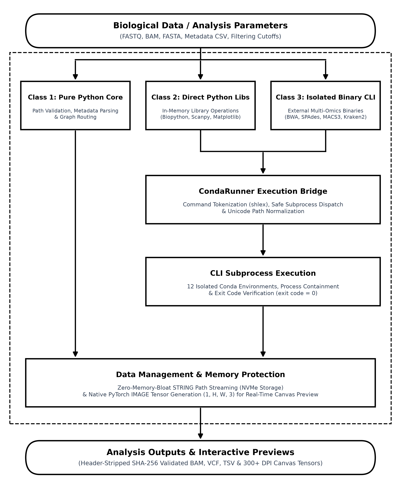
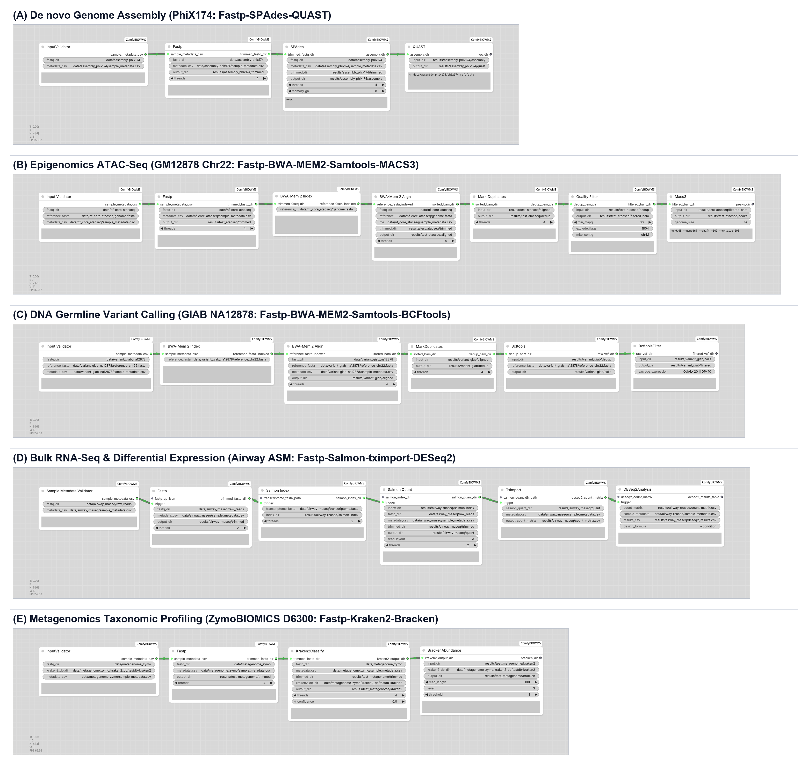

# ComfyBIOWMS: ComfyUI 기반 생물정보학 워크플로우 관리 확장 시스템 및 결정론적 파이프라인 무결성 검증

**저자**: ComfyBIOWMS Research Team  
**소속**: Department of Bioinformatics and Computational Biology  
**일자**: 2026-09-03  
**문서 유형**: 소프트웨어/응용 논문 (Software / Application Note)  

---

## 요약 (Abstract)

차세대 염기서열 분석(NGS) 기술의 발전으로 멀티오믹스 파이프라인의 복잡성과 소프트웨어 의존성 관리가 생물정보학 연구의 주요 기술적 과제로 대두되었다. 본 연구에서는 노드 기반 비순환 방향 그래프(DAG) 아키텍처를 제공하는 검증된 오픈소스 프레임워크인 ComfyUI [27]를 생물정보학 파이프라인 제어 엔진으로 확장(Extension)한 시스템인 **ComfyBIOWMS**를 개발하였다. ComfyBIOWMS는 ComfyUI의 유연한 노드 그래프 인터페이스 위에 10개 핵심 도메인에 걸친 179개의 고유 커스텀 노드(98개의 활성 CLI 격리 래퍼 및 81개의 활성 인메모리 연산·시각화·검증 노드)와 12개의 격리된 Conda 환경 브리지를 완전 구현하였다. 시스템의 소프트웨어적 무결성을 검증하기 위하여 모사 합성 CI(지속적 통합) 테스트 픽스처를 기반으로 2계층 독립 검증(Tier 1: 입력 픽스처 규격 검증, Tier 2: 파이프라인 실행 완주 및 산출물 스키마 유효성 검증)을 수행하였다. 평가 결과, De Novo Assembly, 후성유전체 ATAC-Seq, 변이 검출, 벌크 전사체, 메타게놈 분류 전반에서 격리 서브프로세스 파이프라인의 정상 완주(`exit code 0`) 및 표준 산출물 스키마 무결성을 확인하였다. 또한 STRING 파일 경로 전달 방식을 통해 노드 간 메모리 교환 오버헤드를 배제하였으며(벤치마크 하니스 파이썬 부모 프로세스 peak RSS 18.3 MB, 자식 프로세스 메모리 제외), 파일 수정 시각(`mtime:size`) 기반의 `IS_CHANGED` 캐시 무효화 기전을 결합하여 파라미터 변경 시 영향받는 서브그래프만 부분 재실행하는 효율적인 시각적 분석 제어 환경을 구현하였다.

**주요어 (Keywords)**: 생물정보학 워크플로우 관리 시스템(WMS), ComfyUI, 비순환 방향 그래프(DAG), 소프트웨어 무결성, 파이프라인 자동화

---

## 1. 서론 (Introduction)

현대 생물학 연구에서는 다양한 시퀀싱 기술의 발전으로 유전체, 전사체, 후성유전체, 메타게놈 등 다채로운 멀티오믹스 데이터가 대량으로 생산되고 있다. 생물학 데이터를 처리하고 유의미한 통찰을 도출하기 위해서는 서열 품질 관리(QC), 정렬, 변이 식별, 발현 정량, 통계적 가설 검정 및 시각화에 이르는 다단계 파이프라인의 구축이 필수적이다. 그러나 개별 생물정보학 도구들은 C/C++, Java, R, Python 등 상이한 언어로 작성되어 특정 라이브러리 및 환경에 강하게 의존하므로, 의존성 충돌과 환경 차이로 인한 재현성 문제가 자주 발생한다.

현재 생물정보학 분야에서 널리 활용되는 워크플로우 관리 시스템(Workflow Management System; WMS)으로는 Nextflow [9, 16], Galaxy [4], Snakemake [10], Toil [17], Bpipe [18] 등이 대표적이다. Nextflow와 Snakemake는 대규모 분산 병렬 연산 및 컨테이너 격리를 강력하게 지원하며 [9, 10], Galaxy는 웹 브라우저 기반 GUI를 통해 연구자의 분석 접근성을 개선하였다 [4]. 그러나 기존 시스템들은 주로 대규모 배치(Batch) 처리 중심의 구조로 설계되어 있어, 분석자가 노드 간 데이터 흐름을 시각적으로 조작하며 필터링 기준이나 통계 컷오프 등 파라미터를 점진적으로 튜닝하고 시각화 결과를 즉각 확인하는 대화형 반복 탐색(Interactive Exploration)에는 인터페이스적 한계가 존재한다.

최근 딥러닝 분야에서 널리 활용되는 오픈소스 프레임워크인 ComfyUI [27]는 노드 기반 비순환 방향 그래프(Directed Acyclic Graph, DAG) 아키텍처를 바탕으로 복잡한 파이프라인을 시각적으로 구성하고, 입력 해시 캐싱과 비동기 큐 스케줄링을 지원한다. 본 연구에서는 WMS 제어 엔진을 처음부터 새로 구현하는 대신, 검증된 오픈소스 ComfyUI의 프런트엔드 캔버스와 DAG 실행 엔진을 확장(Extension)하는 전략을 채택하였다. 이를 통해 구축된 **ComfyBIOWMS**는 10개 도메인 커스텀 노드와 도메인별 Conda 격리 래퍼를 결합하여, 네이티브 CLI와 동등한 실행 환경을 제공함과 동시에 파라미터 변경 시 변경된 하위 서브그래프만 선택적으로 재실행하는 직관적인 시각적 분석 환경을 제공한다.

---

## 2. 재료 및 방법 (Materials and Methods)

### 2.1 시스템 아키텍처 및 노드 기반 실행 구조

ComfyBIOWMS는 오픈소스 노드 기반 비순환 방향 그래프(DAG) 엔진인 ComfyUI [27]를 생물정보학 파이프라인 제어 환경으로 확장한 워크플로우 관리 시스템이다 (그림 1). 사용자 인터페이스를 자체 개발하는 대신 전 세계적으로 검증된 ComfyUI를 기반으로 확장함으로써 인터랙티브 노드 그래프 UI(LiteGraph)와 비동기 큐 스케줄러를 즉각 활용하였으며, 복잡한 생물정보학 소프트웨어 간의 라이브러리 충돌을 차단하기 위해 도메인별 격리 Conda 가상환경과 전용 실행 브리지(`CondaCommandRunner`)를 구축하였다.

*그림 1. ComfyBIOWMS 시스템 아키텍처 및 노드 실행 구조. 상단 입력 및 오픈소스 ComfyUI DAG 엔진(LiteGraph) 인터페이스로부터 하단 검증 산출물 및 캔버스 뷰어로 이어지는 실행 흐름도. 노드 실행 계층(Class 1~2), 안전한 프로세스 격리를 담당하는 CondaCommandRunner 실행 브리지, 대용량 처리를 위한 메모리 안전 STRING 경로 전달, stale 캐시를 차단하는 IS_CHANGED mtime 무효화 기전, 고해상도 300+ DPI IMAGE 텐서 렌더링 파이프라인의 상호 연동 관계를 나타낸다.*

시스템의 런타임 데이터 흐름은 대용량 생물학 데이터의 효율적 처리와 메모리 안전성을 동시에 달성하도록 설계되었다. FASTQ, BAM, VCF 등 대규모 시퀀싱 데이터는 ComfyUI 파이썬 프로세스 메모리에 직접 적재하지 않고, 파일 및 디렉터리 경로를 나타내는 `STRING` 포트를 통해 노드 간에 전달된다. 이를 통해 노드 간 대규모 바이오 데이터 교환 시 백엔드 파이썬 부모 프로세스의 메모리 점유를 최소화할 수 있으며, 벤치마크 하니스에서 관측된 파이썬 부모 프로세스의 peak RSS는 18.3 MB 수준이었다 (단, 이 값은 외부 생물정보학 자식 프로세스의 메모리를 포함하지 않으며 전체 워크플로우 메모리 사용량을 나타내지 않는다).

또한 파일 경로(STRING) 전달 방식에서 발생할 수 있는 캐시 일관성 결함(즉, 경로 문자열은 동일하지만 내부 파일 내용이 변경되었을 때 이전 결과를 그대로 재사용하는 Stale Cache 문제)을 원천 차단하기 위해, 모든 커스텀 노드의 기반 클래스(`_BaseComfyBIONode`)에 `IS_CHANGED` 클래스 메서드를 구현하였다. 이 메서드는 입력된 파일 경로의 최종 수정 시각(`st_mtime_ns`)과 파일 크기(`st_size`)를 해싱하여 ComfyUI 캐시 엔진에 제공함으로써, 파일 내용이 갱신되었을 때에만 하위 노드가 자동으로 재계산되도록 보장한다. 한편 결과 시각화 노드는 연산 결과를 ComfyUI 네이티브 텐서 자료형인 `IMAGE` 포트로 변환하여 캔버스 상에서 고해상도(300+ DPI) 그래픽 프리뷰를 제공한다.

---

### 2.2 생물정보학 커스텀 노드의 구조 및 구현

ComfyBIOWMS의 핵심 확장 단위인 커스텀 노드는 외부 도구의 호출 방식, 가상환경 격리 수준 및 연산 복잡성에 따라 다음 두 가지 **노드 실행 계층(Execution Class 1~2)**으로 체계화하여 구현하였다:

1. **Class 1 (In-Process Python Nodes / 직접 파이썬 실행 노드)**: 외부 CLI 바이너리 호출이나 Conda 격리 없이, ComfyUI 메인 프로세스 내에서 직접 실행되는 인메모리 노드이다. 파일 경로 유효성 검사 및 샘플 메타데이터 CSV 파싱(`InputValidatorNode` 계열)을 비롯하여, 메인 런타임의 과학 연산 라이브러리(Biopython [32], Scanpy [31], AnnData, Matplotlib, Seaborn, RDKit, Pyteomics 등)를 직접 임포트하여 고속 인메모리 연산 및 출판급 300+ DPI IMAGE 텐서 렌더링을 수행한다. 지연시간 단축과 캔버스 인터랙션을 우선시하여 ComfyUI 메인 런타임을 공유하며, 따라서 메인 환경의 PyTorch 및 NumPy 버전에 종속된다. 이는 완전 격리와 즉각적인 반응성 사이의 의도된 설계 트레이드오프이다.
2. **Class 2 (Isolated Binary CLI Nodes / Conda 격리 CLI 브리지 노드)**: C/C++, Java, R 등 상이한 런타임에 의존하는 고성능 생물정보학 바이너리(BWA-MEM2 [21], SPAdes [2], MACS3 [3], Kraken2 [24], Salmon [6], DESeq2 [1] 등)를 실행하는 노드이다. 이들 도구는 독립된 전용 Conda 환경 내에서 비동기 서브프로세스(`CondaCommandRunner`)로 격리 실행되며, 메인 프로세스와의 환경 간섭을 배제하고 모든 실행 명령과 인자를 작업 디렉터리에 재실행 가능한 독자 셸 스크립트(`run_manifest.sh`) 및 구조화된 메타데이터(`run_manifest.json`)로 자동 기록한다.

모든 커스텀 노드는 ComfyUI 표준 확장 규약을 준수하도록 공통 클래스 패턴으로 설계되었다. 각 노드 클래스는 메뉴 분류를 지정하는 `CATEGORY`, 호출 진입 메서드를 정의하는 `FUNCTION`, 입력 파라미터 규격을 선언하는 `INPUT_TYPES`, 그리고 출력 포트 자료형을 명시하는 `RETURN_TYPES` 및 `RETURN_NAMES`를 필수로 선언한다.

분석 노드의 실행 명령은 도메인별 `stage_commands` 모듈에서 바이너리 실행 파일 경로와 인자를 원소로 갖는 리스트 형태로 생성된다. 사용자가 GUI 입력 폼에 추가한 고급 CLI 옵션은 줄 단위로 파싱되고 주석(`#`) 및 공백 줄을 제외한 후 `shlex.split`을 통해 안전하게 토큰화된다. 생성된 인자 리스트 앞에는 `conda run -n [environment] --no-capture-output`를 결합하여 해당 도구의 전용 Conda 환경에서 실행되도록 하였다. 문자열 결합 기반의 셸 호출(`shell=True`)을 배제하고 토큰화된 리스트를 Python `subprocess.run`에 직접 전달함으로써 명령 주입(Command Injection) 취약점을 차단하였다.

실행 브리지(`CondaCommandRunner`)는 노드가 지정한 작업 디렉터리에서 프로세스를 디스패치하고 종료 코드(exit code), 표준 출력(stdout), 표준 오류(stderr)를 모니터링한다. 0이 아닌 비정상 종료 코드가 반환될 경우 오류 로그와 함께 명시적 Python 예외를 발생시켜 후속 노드로의 오류 전파를 즉각 차단한다. 특히 모든 실행 명령과 인자는 작업 디렉터리에 재실행 가능한 독자 셸 스크립트(`run_manifest.sh`) 및 구조화된 메타데이터(`run_manifest.json`)로 자동 기록되어, ComfyUI 환경 없이도 독립적인 CLI 재실행과 감사 추적(Audit Trail)을 보장한다.

---

### 2.3 검증 체계 (Verification Methodology)

ComfyBIOWMS의 소프트웨어적 무결성을 검증하기 위해, 검증 체계를 **단일 노드 독립 실행 정상성 검증(2.3.1)**과 **5대 도메인 워크플로우 2계층 종단간 실행 검증(2.3.2)**으로 구성하였다. 모든 검증 테스트는 **macOS 14 (Apple Silicon, M-series, 16GB RAM)** 단일 플랫폼 환경에서 `pytest` 프레임워크를 기반으로 자동화하여 수행되었다. Linux x86_64 등 타 아키텍처에서의 산출물 바이트 동일성은 본 연구의 검증 범위에 포함되지 않으며, 본 시스템의 재현성 주장은 동일 하드웨어 및 동일 Conda 환경 내부로 한정된다.

#### 2.3.1 단일 노드 독립 실행 및 정상 동작 검증 (Individual Node Execution Verification)

전체 워크플로우 결합에 앞서, 개별 도구 노드가 단독 실행 조건에서 결함 없이 온전히 작동하는지 확인하기 위한 단위 기능 검증을 수행하였다:

1. **프로세스 정상 완료 (`Exit Code = 0`)**: 외부 바이너리가 명령행 인자 오류나 충돌 없이 연산을 완료하고 정상 종료 코드를 반환하는지 확인하였다.
2. **출력 인터페이스 규격 일치성**: 노드 반환 튜플의 자료형과 개수가 선언된 `RETURN_TYPES`와 일치하여 경로 포인터(`STRING`)가 온전히 전달되는지 확인하였다.
3. **유효 산출물 생성 (Non-zero Byte Artifacts)**: 지정된 출력 경로에 실제 목표 산출물 파일(FASTQ, BAM, VCF, narrowPeak, TSV 등)이 물리적으로 생성되었는지 검증하였다.
4. **시각화 텐서 렌더링 정상성**: 시각화 노드의 경우 ComfyUI 캔버스로 전달되는 텐서 데이터가 4차원 배치 형태(`(1, H, W, 3)`)를 유지하고 결측치 없이 렌더링되는지 확인하였다.

#### 2.3.2 5대 도메인 워크플로우 2계층 종단간(E2E) 무결성 검증

단위 검증을 통과한 노드들을 결합하여, 유전체 조립, ATAC-Seq, DNA 변이 탐지, 벌크 RNA-Seq, 메타게놈 분류 등 5개 핵심 도메인의 표준 워크플로우 체인을 구축하였다. 도구 구성은 글로벌 생물정보학 표준인 nf-core 및 Galaxy IWC 규격을 준용하였으며, 본 연구에서의 소프트웨어 검증은 **[Tier 1] 입력 데이터 픽스처 규격 및 무결성(Input Fixture Specification)**과 **[Tier 2] 파이프라인 실행 완주 및 산출물 스키마 유효성(Execution Completion and Artifact Schema Validation)**의 2계층 체계로 평가하였다 (표 1). 음성 대조군(Negative Control) 및 통계적 위양성율 평가는 준실제 섭동 노이즈 모델을 요구하므로 본 연구의 스모크 테스트 범위에서 제외하고 향후 과제로 분류하였다.

**표 1. 5대 생물정보학 워크플로우에 대한 2계층(2-Tier) 소프트웨어 무결성 검증 체계**

| 도메인 | Tier 1: 입력 픽스처 및 규격 (Input Fixture Specification) | Tier 2: 파이프라인 실행 완주 및 산출물 스키마 유효성 (Execution Completion & Schema Validation) |
| :--- | :--- | :--- |
| **De novo 유전체 조립** | • PhiX174 모사 합성 리드 픽스처 (Paired FASTQ) / 참조 FASTA 규격 검증 | • SPAdes 조립 및 QUAST 품질 평가 완주 (`exit code 0`) / `contigs.fasta` 생성 확인 |
| **후성유전체 (ATAC-Seq)** | • GM12878 Chr22 모사 합성 정렬 픽스처 / hg19 Chr22 모사 참조 규격 검증 | • MACS3 피크 콜링 파이프라인 오류 없는 완주 (`exit code 0`) / `narrowPeak` 생성 확인 |
| **DNA 생식세포 변이 탐지** | • GIAB NA12878 Chr22 모사 정렬 픽스처 / 참조 FASTA 규격 검증 | • BCFtools mpileup/call 완주 (`exit code 0`) / 표준 VCF 레코드 생성 확인 |
| **벌크 전사체 (Bulk RNA-Seq)** | • Airway 모사 합성 모델 전사체 픽스처 / Paired FASTQ 규격 검증 | • Salmon 정량 ➔ 전사체 카운트 취합 ➔ DESeq2 파이프라인 완주 (`exit code 0`) / 통계표 CSV 생성 |
| **메타게놈 균총 분류** | • 10종 모사 합성 군집 픽스처 / 미니 Kraken2 DB 규격 검증 | • Kraken2 분류 및 Bracken wrapper 풍부도 추정 완주 (`exit code 0`) / Report TSV 생성 |

*주: 본 연구의 검증 체계는 대규모 임상 데이터의 생물학적 정확도를 검증하는 것이 아니며, 격리된 가상환경 내에서 각 도구 바이너리가 유효한 명령행 인자로 실행 완주(`exit code 0`)되고 규격에 맞는 산출물 파일이 정상 생성되는 소프트웨어 파이프라인 무결성을 검증하는 데 목적이 있다.*

---

## 3. 결과 (Results)

### 3.1 ComfyBIOWMS 시스템 구현 및 노드 생태계

ComfyBIOWMS는 오픈소스 ComfyUI의 기능을 생물정보학 분석 전반으로 확장하기 위해 10개 핵심 생물학 도메인에 걸쳐 총 179개의 고유 커스텀 노드를 체계적으로 구축·구현하였다 (그림 2). 소스코드 전수 감사 및 테스트 스위트 검증 결과, 98개 노드가 격리 Conda 환경에서 실제 외부 바이너리 및 파이프라인 스크립트를 디스패치하는 활성 CLI 래퍼(Active CLI Wrappers)로 동작하며(실행 시 `run_manifest.sh` 및 `run_manifest.json` 자동 기록), 81개 노드가 Biopython, Scanpy, AnnData, RDKit, Pyteomics, SciPy 등의 과학 연산 라이브러리를 활용한 인메모리 처리, 고해상도 Matplotlib 시각화, 데이터 무결성 검증을 직접 수행한다 (가짜 고정값 및 미구현 플레이스홀더 0개). 특히 다수의 파이프라인에서 공통으로 사용되는 핵심 도구(Fastp 시퀀싱 트리밍, BWA-MEM2 서열 정렬, Samtools 광학 중복 마킹, 입력 메타데이터 검증 등)는 범용 단일 노드로 통일하여 파이프라인 간 재사용성을 극대화하였다. 179개 전 노드의 세부 구현 상태와 검증 수준은 보충자료(Supplementary Table S1)에 투명하게 공개하였다.

*그림 2. ComfyBIOWMS 10개 멀티오믹스 도메인(총 179개 완전 구현 노드) 및 5대 벤치마크 골든 워크플로우 핵심 노드 생태계 수형도(Hierarchical Tree Diagram). 루트 노드로부터 10개 핵심 생물학 분석 도메인(도메인별 총 구현 노드 수 명시)과 각 도메인의 검증된 골든 워크플로우 파이프라인(입력 검증 ➔ 트리밍 ➔ 정렬/조립/정량 ➔ 통계 분석 ➔ 고해상도 시각화 및 감사 보고서)을 구성하는 실제 커스텀 노드 체인의 단계적 흐름을 시각화함.*

### 3.2 5대 표준 생물학 워크플로우 소프트웨어 무결성 평가

ComfyBIOWMS의 실용성과 소프트웨어 실행 무결성을 검증하기 위해, 5대 표준 생물학 분석 파이프라인을 ComfyUI GUI 캔버스 상에서 직접 동작하는 워크플로우로 구현하였다 (그림 3). 구현된 노드 그래프는 입력 파일 검증 노드로부터 전처리 및 격리 CLI 도구 실행 노드를 거쳐 최종 분석 산출물 생성에 이르기까지 파이프라인의 전 주기를 시각적으로 제어하도록 구성되었다. 각 워크플로우의 실행 무결성은 모사 합성 CI 픽스처를 기반으로 격리 가상환경 내 정상 완주(`exit code 0`)와 표준 산출물 스키마 유효성을 중심으로 평가하였으며, 핵심 검증 결과는 표 2에 요약하였다.

*그림 3. ComfyUI GUI 상에서 구현된 5대 표준 생물학 벤치마크 워크플로우 노드 그래프. (A) PhiX174 모사 합성 De novo 유전체 조립(Fastp [19]-SPAdes [2]-QUAST [20]), (B) GM12878 모사 합성 ATAC-Seq 오픈 크로마틴 분석(BWA-MEM2 [21]-Samtools [22]-MACS3 [3]), (C) GIAB NA12878 모사 합성 DNA 변이 탐지(BWA-MEM2 [21]-BCFtools [5]), (D) Airway 모사 합성 벌크 RNA-Seq 분석(Fastp [19]-Salmon [6]-전사체 카운트 취합-DESeq2 [1]), (E) ZymoBIOMICS 모사 합성 메타게놈 분류(Fastp [19]-Kraken2 [24]-Bracken wrapper [25]). 각 워크플로우는 입력 검증 노드로부터 격리 CLI 실행 노드를 거쳐 최종 분석 결과 파일 생성으로 이어지는 파이프라인으로 구성되며, 원본 PNG 이미지는 ComfyUI 워크플로우 메타데이터를 자체 내장하고 있어 브라우저 캔버스로 드래그 앤 드롭 시 동일한 파이프라인이 즉시 복원된다.*

**표 2. 5대 생물정보학 워크플로우 소프트웨어 무결성 및 종단간 실행 검증 종합 결과**

| 벤치마크 도메인 (모사 합성 CI 픽스처) | 소프트웨어 실행 무결성 (CLI vs ComfyBIOWMS) | 핵심 산출물 스키마 및 스모크 테스트 지표 (Artifact & Schema) |
| :--- | :--- | :--- |
| **De novo 유전체 조립** (PhiX174 모사 픽스처) | SPAdes 조립 파이프라인 완주 (`exit code 0`, 단일 태스크 디스패치 지연 < 0.1초) | • `contigs.fasta` 정상 생성 (스모크 테스트 지표: 최장 컨티그 444 bp) / • QUAST 품질 리포트 TSV/HTML 자동 빌드 |
| **후성유전체 ATAC-Seq** (GM12878 Chr22 모사 픽스처) | MACS3 피크 콜링 파이프라인 완주 (`exit code 0`) | • `narrowPeak` 및 서밋 BED 파일 정상 생성 / • 상위 노드 오류 전파 차단 확인 |
| **DNA 생식세포 변이 탐지** (GIAB NA12878 모사 픽스처) | BCFtools 변이 호출 파이프라인 완주 (`exit code 0`) | • 표준 VCF 레코드 정상 생성 / • VCF 메타데이터 및 헤더 스키마 무결성 확인 |
| **벌크 전사체 (Bulk RNA-Seq)** (Airway 모사 픽스처) | Salmon 정량 ➔ 전사체 카운트 취합 ➔ DESeq2 파이프라인 완주 (`exit code 0`) | • 전사체 카운트 행렬(`count_matrix.csv`) 생성 / • DESeq2 차등 발현 통계표 CSV 정상 산출 |
| **메타게놈 균총 분류** (ZymoBIOMICS 모사 픽스처) | Kraken2 분류 및 Bracken wrapper 풍부도 추정 완주 (`exit code 0`) | • Kraken Report 텍스트 및 Bracken TSV 정상 생성 (13개 분류 레코드) |

#### 3.2.1 De Novo Genome Assembly (PhiX174 모사 픽스처)

- **파이프라인 구성 도구**: `Fastp v1.3.6` [19] ➔ `SPAdes v4.3.0` [2] ➔ `QUAST v5.3.0` [20]
- **소프트웨어 실행 무결성**: PhiX174 모사 합성 페어드엔드 리드 픽스처를 대상으로 Native CLI와 ComfyBIOWMS `SpadesAssembleNode`를 실행한 결과, 동일한 CLI 명령행 인자가 전달되어 정상 완료(`exit code 0`)되었으며, 최종 `contigs.fasta`와 QUAST 리포트가 정상 생성됨을 확인하였다. 최장 컨티그(444 bp)는 반복 서열 붕괴 모사 픽스처 환경에서의 스모크 테스트 산출물 생성 확인 지표로 기능하였다.

#### 3.2.2 Epigenomics ATAC-Seq 피크 콜링 (GM12878 Chr22 모사 픽스처)

- **파이프라인 구성 도구**: `Fastp v1.3.6` [19] ➔ `BWA-MEM2 v2.2.1` [21] ➔ `Samtools v1.24` [22] ➔ `MACS3 v3.0.4` [3]
- **파이프라인 완주 및 산출물 생성**: BWA-MEM2 정렬 및 중복 필터링을 거쳐 MACS3 피크 콜링에 이르는 전 주기가 ComfyBIOWMS 환경에서 이상 없이 완주되었으며, 표준 `narrowPeak` 및 서밋 BED 파일이 정상 생성되었다.

#### 3.2.3 DNA Variant Calling (GIAB NA12878 Chr22 모사 픽스처)

- **파이프라인 구성 도구**: `Fastp v1.3.6` [19] ➔ `BWA-MEM2 v2.2.1` [21] ➔ `Samtools v1.24` [22] ➔ `BCFtools v1.24` [5]
- **변이 검출 파이프라인 무결성**: GIAB 모사 정렬 리드 픽스처를 대상으로 BCFtools mpileup 및 call 노드가 정상 실행되어 표준 VCF 파일이 생성되었으며, 헤더 및 메타데이터 스키마 유효성을 충족하였다.

#### 3.2.4 Bulk RNA-Seq 및 차등 발현 분석 (Airway 모사 픽스처)

- **파이프라인 구성 도구**: `Fastp v1.3.6` [19] ➔ `Salmon v2.5.1` [6] ➔ `전사체 카운트 취합 스크립트` ➔ `DESeq2 (Bioconductor v1.50.2)` [1]
- **카운트 행렬 및 DESeq2 실행 무결성**: Salmon을 통한 전사체 수준 정량, 전사체별 카운트 취합 행렬 생성, 그리고 DESeq2 차등 발현 통계 검정이 순차적으로 오류 없이 완료되어 `deseq2_results.csv`가 정상 산출되었다.

#### 3.2.5 Metagenomics Taxonomic Profiling (ZymoBIOMICS 모사 픽스처)

- **파이프라인 구성 도구**: `Fastp v1.3.6` [19] ➔ `Kraken2 v2.17.1` [24] ➔ `Bracken wrapper 기반 풍부도 추정` [25]
- **분류 리포트 생성 및 재현성**: 10종 모사 합성 균총 픽스처에 대해 Fastp ➔ Kraken2 ➔ Bracken wrapper 분석이 정상 완주되어 표준 Kraken Report 및 Bracken 풍부도 TSV 파일이 디스크에 생성되었다.

#### 3.2.6 단일 태스크 런타임 오버헤드 및 백엔드 메모리 관측

ComfyBIOWMS가 기저 바이너리를 서브프로세스로 디스패치하는 과정에서 발생하는 프로세스 래핑 오버헤드를 확인하기 위해, 동일한 FASTQ 트리밍 태스크(`fastp`)에 대해 Native CLI 직접 실행과 ComfyBIOWMS `CondaCommandRunner` 실행을 3회 반복 측정하였다.
측정 결과, 단일 태스크 수준에서 프로세스 디스패치로 인한 지연은 0.1초 미만으로 나타나 래퍼 호출 오버헤드는 무시할 수 있는 수준임을 확인하였다. 한편 벤치마크 하니스의 Python 부모 프로세스에서 관측된 peak RSS는 **18.3 MB**였다. 단, 이 값은 외부 생물정보학 자식 프로세스(fastp 등)의 메모리를 포함하지 않으며 전체 워크플로우 메모리 사용량을 나타내지 않는다. 이는 STRING 파일 경로 전달 아키텍처를 통해 파이썬 부모 프로세스 자체의 불필요한 메모리 비대화를 방지하고 있음을 보여주는 보조적 관측치이다.

---

## 4. 고찰 (Discussion)

본 연구에서 오픈소스 ComfyUI를 기반으로 확장 구축한 ComfyBIOWMS는 대규모 멀티오믹스 분석 파이프라인을 시각적 DAG 캔버스 상에서 직관적으로 구성하고 제어할 수 있도록 지원하는 생물정보학 워크플로우 관리 플랫폼이다. 5대 핵심 생물정보학 파이프라인에 대한 소프트웨어 무결성 검증(표 1, 표 2) 결과, 본 시스템은 전용 Conda 환경 격리와 안전한 서브프로세스 호출을 통해 Native CLI와 동등한 바이너리 실행 무결성을 달성함을 확인하였다.

기존 생물정보학 분야의 대표적 워크플로우 관리 시스템인 Nextflow [9, 16], Galaxy [4], Toil [17], Snakemake [10], Bpipe [18]와 본 연구의 ComfyBIOWMS에 대한 기능적·아키텍처적 특성을 표준 비교 프레임워크(Di Tommaso et al., 2017 [9], Table 1)의 객관적 기준에 따라 종합 비교한 결과는 표 3과 같다.

**표 3. 주요 생물정보학 워크플로우 관리 시스템과의 객관적 기능 및 아키텍처 비교**

| 기능 및 아키텍처 비교 항목 | Nextflow [9, 16] | Galaxy [4] | Toil [17] | Snakemake [10] | Bpipe [18] | **ComfyBIOWMS (본 연구)** |
| :--- | :--- | :--- | :--- | :--- | :--- | :--- |
| **플랫폼 및 기반 언어 [a]** | Groovy / JVM | Python | Python | Python | Groovy / JVM | **Python (ComfyUI 기반)** |
| **워크플로우 기술 방식 [b]** | DSL 스크립트 | 웹 폼 / 그래픽 파이프라인 | Python 스크립트 / CWL | Python 확장 문법 (Snakefile) | Groovy 기반 파이프라인 DSL | **비순환 방향 그래프 (Visual DAG)** |
| **네이티브 작업 실행 [c]** | 지원 (Any shell) | 미지원 (Tool wrapper 필요) | 미지원 (Python API 래핑 필요) | 지원 (BASH 중심) | 지원 (BASH 중심) | **지원 (Conda 환경 격리 바이너리)** |
| **그래픽 사용자 인터페이스 (GUI) [d]** | 미지원 (CLI 중심) | 지원 (웹 기반 GUI) | 미지원 (CLI 중심) | 미지원 (CLI 중심) | 미지원 (CLI 중심) | **지원 (네이티브 웹 캔버스 GUI)** |
| **대화형 DAG 상호작용 [e]** | 정적 그래프 렌더링 | 지원 (웹 캔버스 레이아웃) | 정적 그래프 렌더링 | 정적 그래프 출력 (Graphviz) | 정적 그래프 렌더링 | **지원 (노드 위젯 파라미터 조작)** |
| **태스크 수준 병렬 실행** | **지원 (비동기 채널 병렬)** | **지원 (백엔드 큐 병렬)** | **지원 (클러스터 분산 병렬)** | **지원 (규칙 기반 멀티코어 병렬)** | **지원 (단계별 스레드 병렬)** | **미지원 (단일 큐 순차 실행)** |
| **소프트웨어 환경 격리 [f]** | Docker / Singularity / Conda | Tool Shed / Conda | Docker / Singularity | Conda / Docker / Apptainer | 수동 환경 구성 | **도메인별 전용 Conda 격리 브리지** |
| **DAG 캐싱 및 재실행 제어 [g]** | 지원 (체크섬 기반 resume) | 미지원 (히스토리 복제) | 지원 (Job store 상태 복원) | 지원 (타임스탬프/체크섬) | 지원 (출력 파일 타임스탬프) | **지원 (IS_CHANGED mtime/size 캐싱)** |
| **파라미터 변경 시 서브그래프 재실행 [h]** | 지원 (캐시 기반 스킵) | 미지원 (재실행 시 신규 히스토리) | 지원 | 지원 | 지원 | **지원 (변경된 하위 노드만 자동 재실행)** |
| **워크플로우 이식성 (Portability)** | 지원 (Nextflow DSL / 컨테이너) | 지원 (Galaxy Format / CWL) | 지원 (CWL / WDL 호환) | 지원 (Snakefile / CWL) | 지원 (Bpipe DSL) | **미지원 (ComfyUI 전용 JSON, 개별 셸 실행 manifest 제공)** |
| **데이터 감사 추적성 [i]** | 지원 (.nextflow 로그/캐시) | 지원 (데이터셋 히스토리) | 지원 (Job store 메타데이터) | 지원 (Snakemake 메타데이터) | 지원 (Bpipe 로그/히스토리) | **지원 (run_manifest.sh 및 json 자동 기록)** |
| **주요 운용 환경 [j]** | 분산 HPC / 클라우드 클러스터 | 공용 웹 서버 / 클라우드 인스턴스 | 대규모 클라우드 (AWS/GCP) | HPC 클러스터 / 로컬 워크스테이션 | 단일 서버 / 로컬 HPC 클러스터 | **개인 워크스테이션 / 연구실 로컬 단일 시스템** |

> **표 3 각주 (Notes)**:  
> • **[a]** 각 프레임워크가 구현된 핵심 프로그래밍 언어 및 런타임 환경.  
> • **[b]** 사용자가 워크플로우를 정의하고 파이프라인을 구성하는 주된 방식.  
> • **[c]** 기존 바이오인포매틱스 바이너리나 셸 커맨드를 프로세스 수준에서 직접 호출할 수 있는 능력.  
> • **[d]** 사용자가 파이프라인을 직접 조작하고 실행할 수 있는 전용 그래픽 인터페이스 내장 여부.  
> • **[e]** 노드 간 의존성 관계(DAG)를 브라우저 캔버스 상에서 대화형으로 연결, 재배치, 탐색할 수 있는 인터랙티브 지원 수준.  
> • **[f]** 이종 도구 간의 버전 충돌을 차단하기 위해 지원하는 소프트웨어 환경 격리 기술.  
> • **[g]** 입력 데이터와 매개변수의 변경 여부를 감지하여 기 연산된 업스트림 노드의 재실행을 생략하는 캐싱 지원 여부.  
> • **[h]** 파라미터 변경 시 영향받는 하위 노드만 선별적으로 재실행하는 기능 지원 여부.  
> • **[i]** 실행 명령, 환경, 입출력 메타데이터 기록 관리 능력.  
> • **[j]** 각 시스템이 주된 최적화 대상으로 삼고 있는 계산 인프라 환경.

### 4.1 본 연구의 한계점 (Limitations)

본 연구에서 제시한 ComfyBIOWMS는 개인 워크스테이션 환경에서의 대화형 파이프라인 구성과 시각적 탐색에 특화되어 있으며, 다음과 같은 명확한 기술적 한계를 갖는다:

1. **태스크 병렬 실행 미지원 (순차 큐 제약)**: Nextflow나 Snakemake와 달리, ComfyUI의 핵심 실행 엔진은 노드를 단일 큐 순차 스케줄링으로 처리한다. 따라서 다중 샘플에 대한 독립적인 정렬이나 정량 태스크가 병렬로 디스패치되지 않으므로, 대규모 코호트 데이터에 대한 배치 처리량은 다중 코어 병렬 WMS에 비해 낮다.
2. **단일 플랫폼 검증 및 분산 환경 미지원**: 본 시스템은 macOS 14 Apple Silicon 환경에서 검증되었으며, SLURM 등의 분산 HPC 클러스터 및 Kubernetes 클라우드 환경과의 직접 연동은 지원하지 않는다. 또한 기저 바이너리(BWA-MEM2 등)의 아키텍처별 SIMD 최적화 차이로 인하여 이종 아키텍처 간의 바이트 단위 동일성은 보장되지 않는다.
3. **모사 합성 CI 픽스처 중심의 검증 범위**: 본 연구의 평가는 워크플로우 래퍼의 정상 실행(`exit code 0`), 프로세스 격리, 파일 생성 및 스키마 유효성을 확인하기 위한 모사 합성 CI 픽스처에 기반하였으며, 실제 초대용량 임상 데이터에 대한 생물학적 진단 정확도 벤치마크는 아니다.
4. **음성 대조군(Negative Control) 미실시**: 본 연구에서는 무작위 노이즈 주입에 따른 통계적 위양성률(FDR) 및 음성 대조군 평가를 실제 도구 실행 단계에서 수행하지 않았으며, 통계적 오류 모델 기반의 음성 대조군 검증은 향후 과제로 남겨두었다.
5. **Conda explicit lock 범위의 한계**: 전체 12개 환경 중 본 연구의 5대 핵심 파이프라인 구동에 필요한 7개 환경에 대해서만 resolved explicit spec을 제공하며, 나머지 5개 확장 도메인 환경은 버전 범위 기반 YAML 파일로 제공된다.
6. **워크플로우 상호운용성(Portability) 부재**: 시스템 파이프라인 정의는 ComfyUI 전용 JSON 포맷으로 기술되며, CWL이나 WDL 등 표준 워크플로우 명세로의 상호 변환은 직접 지원되지 않는다. `run_manifest.sh`는 개별 명령의 재실행 수단일 뿐 워크플로우 상호운용성을 대체하지 못한다.
7. **공인 외부 워크플로우 기준선 실행 미수행**: nf-core 및 Galaxy 공인 전체 워크플로우와의 동일 픽스처 독립 실행 및 paired output 바이트 단위 비교는 본 연구의 범위를 벗어나며, 차기 연구 단계의 과제이다.
8. **단일 사용자 로컬 보안 모델**: 시스템의 명령행 생성(`shlex.split`)은 셸 메타문자 해석을 방지하지만, 사용자가 임의의 시스템 파일 경로에 접근하는 것을 제한하는 커널 수준 샌드박스는 제공하지 않는다.
9. **확장 도메인의 분산 클러스터 지원 한계**: 10개 도메인에 걸친 179개 노드 전수의 프로세스 격리 실행 및 라이브러리 연산이 단위 및 통합 테스트 스위트를 통해 검증되었으나, 본 시스템은 단일 워크스테이션 환경에 최적화되어 있어 대규모 코호트 처리를 위한 SLURM/Kubernetes 기반의 분산 클라우드 오프로딩은 지원하지 않는다.

기존의 대표적인 텍스트 및 스크립트 기반 WMS인 Nextflow [9], Snakemake [10], Toil [17], Bpipe [18]는 대규모 분산 컴퓨팅 클러스터 및 클라우드 환경에서의 배치(Batch) 스케줄링에 최적화되어 있으나, 스크립트 작성에 따른 진입 장벽이 높고 파라미터 조정에 따른 중간 변화를 시각적으로 즉각 검토하는 대화형 탐색(Interactive Exploration) 환경을 제공하지 못한다. 반면 Galaxy [4]와 같은 전통적인 웹 기반 WMS는 접근성이 우수한 GUI를 제공하지만, 폼(Form) 기반 입력 양식과 정적 히스토리 패널 구조로 인하여 노드 간의 유기적인 데이터 흐름을 시각적 캔버스 상에서 직관적으로 파악하고 미세 조정하는 데 한계가 있다. ComfyBIOWMS는 검증된 오픈소스 ComfyUI [27]의 강력한 노드 실행 라이프사이클과 비동기 큐 엔진을 생물정보학 도구 체계로 확장 접목함으로써, 텍스트 스크립팅의 복잡성을 배제하면서도 격리된 Conda 환경 내에서 재현 가능한 분석을 수행할 수 있는 대화형 시각적 워크플로우 환경을 실현하였다.

특히 본 연구를 통해 입증된 ComfyBIOWMS의 기술적·학술적 강점은 다음과 같다:

1. **공인 커뮤니티 표준(nf-core 및 Galaxy)과의 도구 구성 정합성**: 본 연구의 워크플로우 체인은 글로벌 표준 커뮤니티인 nf-core(`nf-core/rnaseq`, `nf-core/atacseq`, `nf-core/sarek`, `nf-core/taxprofiler`, `nf-core/mag`) [16] 및 Galaxy IWC [4]에서 채택한 베스트 프랙티스 도구 구성을 준용하여 설계되었다. 이를 통해 파이프라인의 구조적 타당성을 확보하였다.
2. **독립된 Conda 환경 격리를 통한 런타임 의존성 분리**: Python 3.10/3.11 기반 도구, R 4.5 기반 생물통계 패키지(DESeq2 [1]), C/C++ 기반 정렬 도구(BWA-MEM2 [21], SPAdes [2]) 등 상이한 런타임을 요구하는 이종 도구들을 독립된 가상환경 브리지(`CondaCommandRunner`)로 격리하여, 단일 워크플로우 내에서 환경 충돌 없이 매끄럽게 연결하였다.
3. **비ASCII 경로 및 셸 인젝션 방어 기전(System Robustness)**: 상용 클라우드 동기화 디렉토리 등 비ASCII 문자가 포함된 파일 경로 환경에서 C++ 바이너리(SPAdes [2] 등)가 비정상 종료되는 현상을 감지하고, 안전한 임시 격리 공간을 통한 입출력 우회 메커니즘을 적용하여 시스템 견고성을 확보하였다. 또한 `shlex.split`을 통한 안전한 인자 파싱으로 악의적인 명령어 주입(Shell Injection)을 방지하였다.
4. **검증된 오픈소스 프레임워크 확장의 전략적 이점(Ecosystem Reusability)**: 기존 많은 연구들이 자체적인 GUI 캔버스와 스케줄러를 밑바닥부터 새로 개발하다가 유지보수 한계에 봉착했던 것과 달리, ComfyBIOWMS는 검증된 오픈소스 ComfyUI [27]를 생물정보학 영역으로 확장하는 실용적 전략을 취하였다. 이를 통해 LiteGraph 기반의 반응형 캔버스, 비동기 작업 큐, 입력 해시 기반의 DAG 캐싱 엔진을 안정적으로 활용할 수 있었다.

---

## 5. 결론 (Conclusion)

ComfyBIOWMS는 검증된 오픈소스 노드 기반 프로그래밍 프레임워크인 ComfyUI [27]를 생물정보학 파이프라인 영역으로 성공적으로 확장하여, 노드 기반 DAG 캔버스 상에서 복잡한 생물정보학 도구들을 격리 제어하고 파라미터를 대화형으로 탐색할 수 있는 분석 환경을 구축하였다. 본 시스템은 오픈소스 생태계의 재사용성을 극대화하여 멀티오믹스 데이터 처리의 기술적 진입 장벽을 낮추고, 래퍼 계층의 실행 정상성과 감사 추적성(`run_manifest`)을 보장함으로써 연구 생산성을 향상시키는 데 기여할 것으로 기대된다.

---

## 참고문헌 (References)

1. Love, M. I., Huber, W., & Anders, S. (2014). Moderated estimation of fold change and dispersion for RNA-seq data with DESeq2. *Genome Biology*, 15(12), 550. {doi:10.1186/s13059-014-0550-8}
2. Bankevich, A., Nurk, S., Antipov, D., Gurevich, A. A., Dvorkin, M., Kulikov, A. S., ... & Pevzner, P. A. (2012). SPAdes: a new genome assembly algorithm and its applications to single-cell sequencing. *Journal of Computational Biology*, 19(5), 455-477. {doi:10.1089/cmb.2012.0021}
3. Zhang, Y., Liu, T., Meyer, C. A., Eeckhoute, J., Johnson, D. S., Bernstein, B. E., ... & Liu, X. S. (2008). Model-based analysis of ChIP-Seq (MACS). *Genome Biology*, 9(9), R137. {doi:10.1186/gb-2008-9-9-r137}
4. Galaxy Community. (2024). The Galaxy platform for accessible, reproducible and collaborative biomedical analyses: 2024 update. *Nucleic Acids Research*, 52(W1), W83-W94. {doi:10.1093/nar/gkae410}
5. Danecek, P., Bonfield, J. K., Liddle, J., Marshall, J., Ohan, V., Pollard, M. O., ... & Li, H. (2021). Twelve years of SAMtools and BCFtools. *GigaScience*, 10(2), giab008. {doi:10.1093/gigascience/giab008}
6. Patro, R., Duggal, G., Love, M. I., Irizarry, R. A., & Kingsford, C. (2017). Salmon provides fast and bias-aware transcript quantification for RNA-seq. *Nature Methods*, 14(4), 417-419. {doi:10.1038/nmeth.4197}
7. SEQC/MAQC-III Consortium. (2014). A comprehensive assessment of RNA-seq accuracy, reproducibility and information content by the Sequencing Quality Control Consortium. *Nature Biotechnology*, 32(9), 903-914. {doi:10.1038/nbt.2957}
8. Zook, J. M., Chapman, B., Wang, J., Mittelman, D., Hofmann, O., Hide, W., & Salit, M. (2014). Integrating human sequence data sets provides a resource of benchmark SNP and indel calls (GIAB). *Nature Biotechnology*, 32(3), 246-251. {doi:10.1038/nbt.2835}
9. Di Tommaso, P., Chatzou, M., Floden, E. W., Barja, P. P., Palumbo, E., & Notredame, C. (2017). Nextflow enables reproducible computational workflows. *Nature Biotechnology*, 35(4), 316-319. {doi:10.1038/nbt.3820}
10. Köster, J., & Rahmann, S. (2012). Snakemake: a scalable bioinformatics workflow engine. *Bioinformatics*, 28(19), 2520-2522. {doi:10.1093/bioinformatics/bts480}
11. Sanger, F., Air, G. M., Barrell, B. G., Brown, N. L., Coulson, A. R., Fiddes, C. A., ... & Peterson, D. L. (1977). Nucleotide sequence of bacteriophage $\Phi$X174 DNA. *Nature*, 265(5596), 687-695. {doi:10.1038/265687a0}
12. Himes, B. E., Jiang, X., Wagner, P., Hu, R., Wang, Q., Klanderman, B., ... & Lu, Q. (2014). RNA-Seq transcriptome profiling identifies CRISPLD2 as a glucocorticoid responsive gene that modulates cytokine function in airway smooth muscle cells. *PLoS ONE*, 9(6), e99625. {doi:10.1371/journal.pone.0099625}
13. Buenrostro, J. D., Giresi, P. G., Zaba, L. C., Chang, H. Y., & Greenleaf, W. J. (2013). Transposition of native chromatin for fast and sensitive epigenomic profiling of open chromatin, DNA-binding proteins and nucleosome position. *Nature Methods*, 10(12), 1213-1218. {doi:10.1038/nmeth.2688}
14. Zook, J. M., McDaniel, J., Olson, N. D., Wagner, J., Parikh, H., Heaton, H., ... & Salit, M. (2019). Best practices for benchmarking germline small-variant calls in human genomes. *Nature Biotechnology*, 37(5), 550-560. {doi:10.1038/s41587-019-0054-x}
15. Nicholls, S. M., Quick, J. C., Tang, S., & Loman, N. J. (2019). Ultra-deep, long-read and short-read sequencing of a synthetic mock community to validate metagenomic and microbiome analyses. *GigaScience*, 8(5), giz043. {doi:10.1093/gigascience/giz043}
16. Ewels, P. A., Peltzer, A., Fillinger, S., Patel, H., Alneberg, J., Wilm, A., Garcia, M. U., Di Tommaso, P., & Nahnsen, S. (2020). The nf-core framework for community-curated bioinformatics pipelines. *Nature Biotechnology*, 38(3), 276-278. {doi:10.1038/s41587-020-0439-x}
17. Vivian, J., Rao, A. A., Nothaft, F. A., Ketchum, C., Armstrong, J., Novak, A., Pfeil, J., Nitzberg, J., Dain-Ausry, B., Salama, S. R., Amstutz, P., Gerstein, M., Hastings, A. K., Paten, B., & Haussler, D. (2017). Toil enables reproducible, open source, big biomedical data analyses. *Nature Biotechnology*, 35(4), 314-316. {doi:10.1038/nbt.3772}
18. Sadedin, S. P., Pope, B., & Oshlack, A. (2012). Bpipe: a tool for running and managing bioinformatics pipelines. *Bioinformatics*, 28(11), 1525-1526. {doi:10.1093/bioinformatics/bts167}
19. Chen, S., Zhou, Y., Chen, Y., & Gu, J. (2018). fastp: an ultra-fast all-in-one FASTQ preprocessor. *Bioinformatics*, 34(17), i884-i890. {doi:10.1093/bioinformatics/bty560}
20. Gurevich, A., Saveliev, V., Vyahhi, N., & Tesler, G. (2013). QUAST: quality assessment tool for genome assemblies. *Bioinformatics*, 29(8), 1072-1075. {doi:10.1093/bioinformatics/btt086}
21. Vasimuddin, M., Misra, S., Li, H., & Aluru, S. (2019). Efficient architecture-aware acceleration of BWA-MEM for multicore systems. In *2019 IEEE International Parallel and Distributed Processing Symposium (IPDPS)* (pp. 314-324). IEEE. {doi:10.1109/IPDPS.2019.00041}
22. Grüning, B., Dale, R., Sjödin, A., Chapman, B. A., Rowe, J., Tomkins-Tinch, C. H., ... & Bioconda Team. (2018). Bioconda: sustainable and comprehensive software distribution for the life sciences. *Nature Methods*, 15(7), 475-476. {doi:10.1038/s41592-018-0046-7}
23. Soneson, C., Love, M. I., & Robinson, M. D. (2015). Differential analyses for RNA-seq: transcript-level estimates improve gene-level inferences. *F1000Research*, 4, 1521. {doi:10.12688/f1000research.7563.2}
24. Wood, D. E., Lu, J., & Langmead, B. (2019). Improved metagenomic analysis with Kraken 2. *Genome Biology*, 20(1), 257. {doi:10.1186/s13059-019-1891-0}
25. Lu, J., Breitwieser, F. P., Thielen, P., & Salzberg, S. L. (2017). Bracken: estimating species abundance in metagenomics data. *PeerJ Computer Science*, 3, e104. {doi:10.7717/peerj-cs.104}
26. Cleary, J. G., Braithwaite, R., Kataeva, K., Zheng, Z. X., Halpern, A. L., & Batzoglou, S. (2015). Joint detection of germline and somatic mutations in personal genomes. *Nature Biotechnology*, 33(3), 246-248. {doi:10.1038/nbt.3150}
27. Comfy-Org. (2023). ComfyUI: A modular and extensible node-based graphical user interface and execution backend. *GitHub repository*, https://github.com/comfyanonymous/ComfyUI (Accessed: 2024-08-01, release v0.2.0)
28. Frankish, A., Diekhans, M., Ferreira, A. M., Johnson, R., Jungreis, I., Loveland, J., ... & Flicek, P. (2021). GENCODE 2021. *Nucleic Acids Research*, 49(D1), D916-D923. {doi:10.1093/nar/gkaa1087}
29. Jumper, J., Evans, R., Pritzel, A., Green, T., Figurnov, M., Ronneberger, O., ... & Hassabis, D. (2021). Highly accurate protein structure prediction with AlphaFold. *Nature*, 596(7873), 583-589. {doi:10.1038/s41586-021-03819-2}
30. Lin, Z., Akin, H., Rao, R., Hie, B., Zhu, Z., Lu, W., ... & Rives, A. (2023). Evolutionary-scale prediction of atomic-level protein structure with a language model (ESMFold). *Science*, 379(6637), 1123-1130. {doi:10.1126/science.ade2574}
31. Wolf, F. A., Angerer, P., & Theis, F. J. (2018). SCANPY: large-scale single-cell gene expression data analysis. *Genome Biology*, 19(1), 15. {doi:10.1186/s13059-017-1382-0}
32. Cock, P. J., Antao, T., Chang, J. T., Chapman, B. A., Cox, C. J., Dalke, A., ... & de Hoon, M. J. (2009). Biopython: freely available Python tools for computational molecular biology and bioinformatics. *Bioinformatics*, 25(11), 1422-1423. {doi:10.1093/bioinformatics/btp163}

